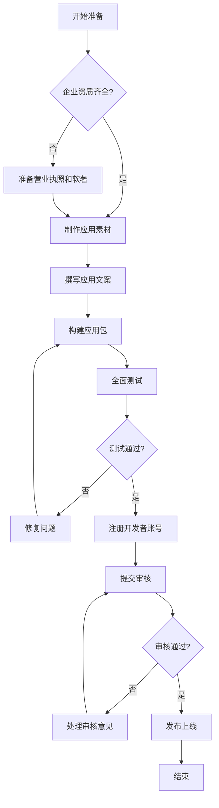

# 应用市场上架准备工作总览

> 完整的准备流程概览和时间规划

## 📋 目录

- [准备阶段概览](#准备阶段概览)
- [整体流程图](#整体流程图)
- [关键里程碑](#关键里程碑)
- [优先级分类](#优先级分类)
- [准备清单](#准备清单)
- [时间估算](#时间估算)

---

## 🎯 准备阶段概览

### 时间规划

**建议准备周期：2-3周**

```
Week 1: 资质准备 + 素材制作
├─ Day 1-2: 企业资质准备
├─ Day 3-4: 应用素材制作
├─ Day 5-6: 文案撰写
└─ Day 7:   内部审核

Week 2: 应用构建 + 测试验证
├─ Day 1-2: Android 构建和测试
├─ Day 3-4: iOS 构建和测试
├─ Day 5-6: 全面功能测试
└─ Day 7:   准备测试账号和说明文档

Week 3: 账号注册 + 提交审核
├─ Day 1-2: 注册开发者账号
├─ Day 3-5: 提交审核
└─ Day 6-7: 等待和应对审核
```

### 关键成功因素

✅ **充分的前期准备** - 资质、素材、文案齐全
✅ **高质量的应用体验** - 稳定、流畅、功能完整
✅ **专业的应用展示** - 精美截图、清晰描述
✅ **快速的问题响应** - 及时处理审核意见

---

## 🔄 整体流程图



---

## 🎯 关键里程碑

### Milestone 1: 资质准备完成 ⏰ Week 1 Day 2

**目标：**

- ✅ 营业执照扫描件准备完成
- ✅ 软件著作权申请已提交（或已获得）
- ✅ 企业联系信息整理完成

**交付物：**

- 营业执照扫描件（PDF + JPG）
- 软著证书（如已获得）
- 企业信息表格

### Milestone 2: 素材制作完成 ⏰ Week 1 Day 4

**目标：**

- ✅ 应用图标（512x512、1024x1024）
- ✅ Android 截图 5张（1080x1920）
- ✅ iOS 截图 5张（1290x2796）
- ✅ 应用宣传视频（可选）

**交付物：**

- 所有尺寸的应用图标
- 分平台的应用截图
- 宣传视频文件（如有）

### Milestone 3: 文案撰写完成 ⏰ Week 1 Day 6

**目标：**

- ✅ 应用描述文案
- ✅ 隐私政策网页
- ✅ 用户服务协议
- ✅ 权限使用说明

**交付物：**

- 应用描述文档
- 隐私政策 URL
- 用户协议 URL
- 权限说明文档

### Milestone 4: 应用构建完成 ⏰ Week 2 Day 4

**目标：**

- ✅ Android Release APK 构建成功
- ✅ iOS Release IPA 构建成功
- ✅ 应用签名配置正确
- ✅ 基础功能测试通过

**交付物：**

- app-arm64-v8a-release.apk
- Runner.ipa
- 构建日志

### Milestone 5: 测试验证完成 ⏰ Week 2 Day 6

**目标：**

- ✅ 所有核心功能测试通过
- ✅ 多设备兼容性验证
- ✅ 测试账号创建完成
- ✅ 使用说明文档准备完成

**交付物：**

- 测试报告
- 测试账号信息
- 使用说明文档

### Milestone 6: 开发者账号就绪 ⏰ Week 3 Day 2

**目标：**

- ✅ Android 各市场开发者账号注册
- ✅ Apple Developer 账号激活
- ✅ 企业认证完成
- ✅ 支付信息配置完成

**交付物：**

- 各平台开发者账号
- 企业认证证明
- 账号权限配置

### Milestone 7: 提交审核 ⏰ Week 3 Day 5

**目标：**

- ✅ Android 主流市场已提交
- ✅ iOS App Store 已提交
- ✅ 所有必填信息完整
- ✅ 审核状态可追踪

**交付物：**

- 提交记录表
- 审核追踪信息
- 应对预案

### Milestone 8: 发布上线 ⏰ 审核通过后

**目标：**

- ✅ 所有平台审核通过
- ✅ 应用正式发布
- ✅ 可公开下载

**交付物：**

- 各平台下载链接
- 发布公告
- 监控数据

---

## 🎯 优先级分类

### P0 - 必须立即开始

这些事项周期长或为硬性要求，必须立即启动：

```
□ 申请软件著作权证书
  - 周期：加急 3-7天，普通 2-3个月
  - 重要性：华为应用市场必需
  - 建议：选择加急申请

□ 准备营业执照扫描件
  - 周期：1天
  - 重要性：所有应用市场必需
  - 建议：加盖企业公章

□ 注册开发者账号
  - Android 各市场：1-3天企业认证
  - Apple Developer：1-2天审核
  - 建议：尽早注册，避免延误

□ 制作隐私政策网页
  - 周期：1-2天
  - 重要性：所有平台必需
  - 建议：使用标准模板
```

### P1 - 本周内完成

这些事项是上架的核心内容：

```
□ 制作应用截图
  - Android: 5张（1080x1920）
  - iOS: 5张（1290x2796）

□ 撰写应用描述文案
  - 一句话描述（20-30字）
  - 详细描述（500-1000字）

□ 准备应用图标
  - 512x512（Android）
  - 1024x1024（iOS）

□ 创建测试账号
  - iOS 审核必需
  - 确保功能完整可用
```

### P2 - 下周完成

这些是技术准备工作：

```
□ 构建 Android Release APK
□ 构建 iOS Release IPA
□ 进行全面功能测试
□ 准备审核说明文档
□ 编写权限使用说明
```

### P3 - 可选准备

这些可以提升通过率和下载转化：

```
□ 制作应用宣传视频（15-30秒）
□ Android 应用加固
□ 多设备兼容性测试报告
□ ASO 关键词优化
□ 应用市场推广素材
```

---

## 📋 准备清单

### 1. 企业资质文件

```
必需：
□ 营业执照扫描件（彩色，加盖公章）
□ 软件著作权证书（华为必需，其他建议）

可能需要：
□ ICP 备案号（涉及信息服务时）
□ 增值电信业务经营许可证（涉及付费时）

企业信息：
□ 公司全称
□ 统一社会信用代码
□ 公司注册地址
□ 联系人姓名
□ 联系电话
□ 联系邮箱
□ 官方网站（如有）
```

### 2. 应用素材

```
应用图标：
□ 512x512 PNG（Android）
□ 1024x1024 PNG（iOS，无透明通道）

Android 截图：
□ 至少 5张
□ 尺寸：1080x1920 或 1080x2340
□ 格式：PNG 或 JPG
□ 大小：每张 ≤8MB

iOS 截图：
□ 至少 3张，最多 10张
□ iPhone 6.7英寸：1290x2796
□ iPhone 6.5英寸：1242x2688
□ 格式：PNG 或 JPG
□ 大小：每张 ≤30MB

宣传视频（可选）：
□ 时长：15-30秒
□ 格式：MP4（Android）、MOV/MP4（iOS）
□ Android：≤30MB，iOS：≤500MB
```

### 3. 文案内容

```
□ 应用名称
□ 应用副标题（iOS）
□ 一句话描述（20-30字）
□ 详细描述（500-1000字）
□ 应用分类
□ 关键词（iOS，100字符）
□ 隐私政策 URL
□ 用户服务协议 URL
□ 权限使用说明
□ 版本更新说明
```

### 4. 技术准备

```
Android：
□ Release APK 构建完成
□ 应用已签名
□ 已启用混淆
□ 已测试安装和运行
□ 应用加固（可选）

iOS：
□ Release IPA 构建完成
□ 证书和描述文件配置正确
□ Bundle ID 设置正确
□ Info.plist 配置完整
□ 已上传到 App Store Connect

测试准备：
□ 测试账号（用户名/密码）
□ 测试数据准备
□ 功能测试通过
□ 多设备兼容性测试
```

### 5. 开发者账号

```
Android：
□ 华为开发者账号
□ 小米开发者账号
□ OPPO 开发者账号
□ vivo 开发者账号
□ 腾讯应用宝账号
□ 其他市场账号（可选）

iOS：
□ Apple Developer 账号
□ App Store Connect 访问权限
□ App ID 已创建
□ 证书配置完成
```

---

## ⏰ 时间估算

### 各项任务时间预估

| 任务 | 预估时间 | 优先级 | 说明 |
|------|----------|--------|------|
| **资质准备** |
| 准备营业执照 | 1天 | P0 | 需要加盖公章 |
| 申请软著（加急） | 3-7天 | P0 | 建议立即申请 |
| 申请软著（普通） | 2-3个月 | P0 | 时间较长 |
| **素材制作** |
| 应用图标 | 2-4小时 | P1 | 需要设计 |
| 应用截图 | 1-2天 | P1 | 包括美化 |
| 宣传视频 | 1-2天 | P2 | 可选 |
| **文案撰写** |
| 应用描述 | 4-6小时 | P1 | 需要打磨 |
| 隐私政策 | 4-6小时 | P0 | 可用模板 |
| 用户协议 | 4-6小时 | P1 | 可用模板 |
| **技术准备** |
| Android 构建 | 2-4小时 | P2 | 包括测试 |
| iOS 构建 | 4-6小时 | P2 | 包括配置 |
| 功能测试 | 1-2天 | P2 | 全面测试 |
| **账号注册** |
| Android 账号 | 1-3天 | P0 | 企业认证 |
| iOS 账号 | 1-2天 | P0 | 审核时间 |
| **提交审核** |
| Android 提交 | 2-4小时 | - | 每个市场 |
| iOS 提交 | 2-3小时 | - | App Store |
| 审核等待 | 1-3天 | - | 各平台不同 |

### 关键路径

```
软著申请(3-7天) ────────────────┐
                                ↓
营业执照准备(1天) ──→ 素材制作(2-3天) ──→ 账号注册(1-3天) ──→ 提交审核(1天) ──→ 审核(1-3天)
                          ↓
                    文案撰写(1-2天)
                          ↓
                    技术准备(2-3天)
```

**关键路径总时间：约 10-21天**（不含普通软著申请时间）

---

## 🚨 风险提示

### 常见延误原因

1. **软著申请时间过长**
   - 风险：普通申请需2-3个月
   - 对策：选择加急申请

2. **开发者账号认证失败**
   - 风险：资质不全，认证被拒
   - 对策：提前准备完整资质

3. **应用审核被拒**
   - 风险：功能不完整、隐私政策不清晰
   - 对策：参考审核检查清单

4. **截图质量不达标**
   - 风险：审核要求重新提交
   - 对策：使用专业工具制作

### 应对策略

```
□ 提前规划，预留缓冲时间
□ 准备多个方案和备选资料
□ 保持与审核团队的沟通
□ 参考成功案例和最佳实践
□ 建立问题快速响应机制
```

---

## ✅ 准备就绪标准

在开始提交审核前，确认以下所有项目都已完成：

### 资质就绪

- [ ] 营业执照扫描件已准备
- [ ] 软著证书已获得（或正在加急申请中）
- [ ] 开发者账号已注册并认证

### 素材就绪

- [ ] 应用图标符合规范
- [ ] 截图数量和质量达标
- [ ] 宣传视频制作完成（如有）

### 文案就绪

- [ ] 应用描述已审核通过
- [ ] 隐私政策网页已上线
- [ ] 用户协议网页已上线

### 技术就绪

- [ ] Android APK 构建成功
- [ ] iOS IPA 构建成功
- [ ] 所有功能测试通过
- [ ] 测试账号可正常使用

### 流程就绪

- [ ] 提交清单已完成
- [ ] 审核应对方案已准备
- [ ] 团队分工已明确

---

## 📞 下一步

完成本文档的阅读后，请按以下顺序进行：

1. 📋 [查看企业资质准备指南](./02-enterprise-qualification.md)
2. 🎨 [查看应用素材制作指南](./03-app-materials-guide.md)
3. ✍️ [查看文案撰写指南](./04-content-writing-guide.md)
4. 🔧 [查看技术准备指南](./05-technical-preparation.md)

---

**文档版本：** v1.0.0  
**最后更新：** 2025-01-29  
**项目版本：** v1.1.0
